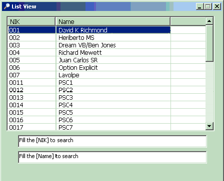



## Find and Highlight Item in Listview

### Description

Finding Item in ListView and Highlight it
 
### More Info
 
NIK and Name input to search the Item in ListView

This Code is based on : D K Richmond Media Library Sample.http://www.Planet-Source-Code.com/vb/scripts/ShowCode.asp?txtCodeId=60524&amp;lngWId=1.

Credit to D K Richmond , Heriberto MS, Juan Carlos SR, Richard Mewett, Ben Jones, Lavolpe, Option Explicit

Highlight the matching item in ListView

             |
---                |---
**Submitted On**   |2007-04-16 00:10:02
**By**             |[Ivan TP](https://github.com/Planet-Source-Code/PSCIndex/blob/master/ByAuthor/ivan-tp.md)
**Level**          |Beginner
**User Rating**    |5.0 (10 globes from 2 users)
**Compatibility**  |VB 6\.0
**Category**       |[Coding Standards](https://github.com/Planet-Source-Code/PSCIndex/blob/master/ByCategory/coding-standards__1-43.md)
**World**          |[Visual Basic](https://github.com/Planet-Source-Code/PSCIndex/blob/master/ByWorld/visual-basic.md)
**Archive File**   |[Find\_and\_H2060584162007\.zip](https://github.com/Planet-Source-Code/ivan-tp-find-and-highlight-item-in-listview__1-68367/archive/master.zip)

